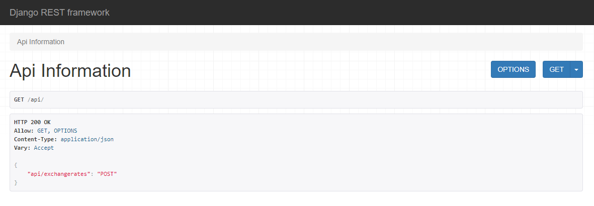
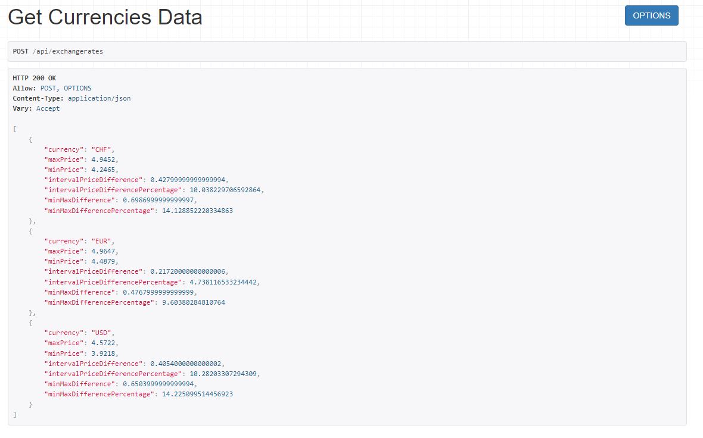
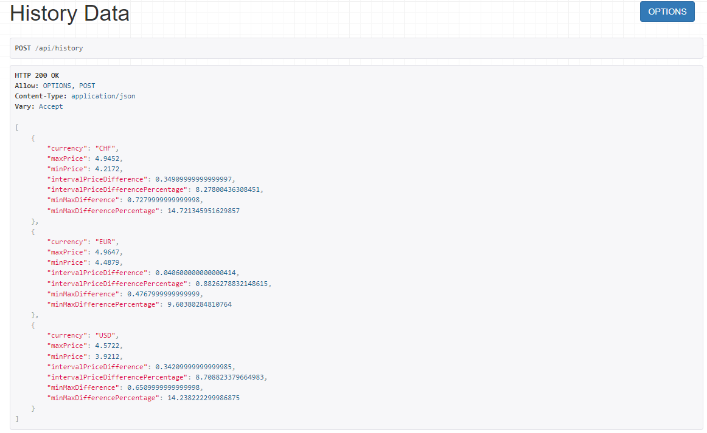

# NBP WEB API


## Contents
* [General](#general)
* [Setup](#setup)
  * [Docker ](#first-method-using-docker)
  * [pip](#second-method-using-pip)
* [Usage](#usage)
* [Technologies](#used-python-libraries)
* [Further ideas](#further-ideas)

## General
This project is a small API, which allows to list basic information about currencies rates against Polish PLN from NBP api, given the abbreviation of the currency and interval of time.

All data is returned in JSON format.

To avoid contacting original endpoint I have created a file containing data from 2021-01-01 to 2022-04-10 so that it is not dependent on outer API. It is just an example solution which does not cover all the data.

## Setup

### First method: using Docker
> Note: Requires [Docker](https://www.docker.com/get-started) and [Docker Compose](https://docs.docker.com/compose/) to run.

Clone repository
```
git clone https://github.com/jakub-mrow/nbp-web-api
```
Open repo directory
```
cd nbp-web-api
```
Build image and run container (detached mode is recommended)
```
docker-compose build
docker-compose up -d
```
To kill container use
```
docker-compose down
```

### Second method: using pip
> Note: Requires [Python](https://www.python.org/)3 and pip to run.

Clone repository
```
git clone https://github.com/jakub-mrow/nbp-web-api
```
Open code directory
```
cd nbp-web-api
```
Install virtualenv
```
pip install virtualenv
```
Go to the project folder and create a virtual environment
```
virtualenv -p python3 venv
```
Active your virtual environment
```
venv\Scripts\activate
```
Install all requirements modules
```
pip install -r docker/requirements.txt
```


Run project
```
python manage.py runserver
```
To stop server
```
Ctrl + C
```
To deactivate virtual environment type in
```
deactivate
```
## Usage

Verify the deployment by navigating to your server address in
your preferred browser.
>Note: Default server works on http://127.0.0.1:8000/api/
```
http://127.0.0.1:8000/api/
```
* ## /api



* ## /api/exchangerates


* ## /api/history

On this endpoint you can only request data from period starting from 2021-01-01 and ending on 2022-04-10. It uses local file and gets information from it.



Example request

```
{
    "currencies": ["USD", "EUR", "CHF"], 
    "period": ["20.10.2021", "10.03.2022"],
    "sortingOrder": "ascending"
}
```
```
currencies - list of currencies
period - interval of time between which we want to get exchange rates
sorting order - (ascending, descending) sorts data by the abbreviation of the currency
```


## Used Python libraries

| Name | Version |
| ------ | ------ |
| Python | 3.9.7 |
| Django | 4.0.3 |
| Django Rest Framework |3.13.1 |
| Requests | 2.27.1 |
| psycopg2 | 2.9.3 |   


## Further ideas
* add unit tests
* add integration tests
* add logging status codes to a file
    